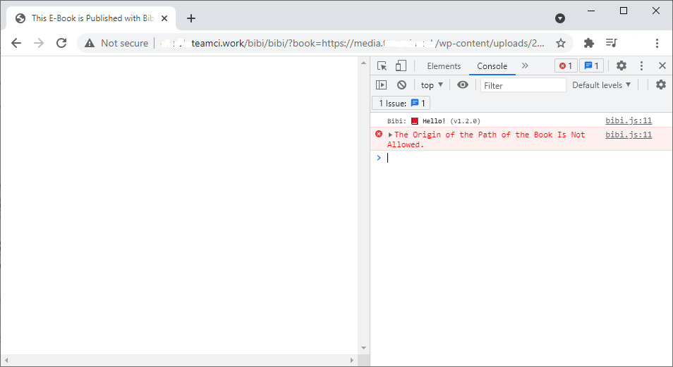
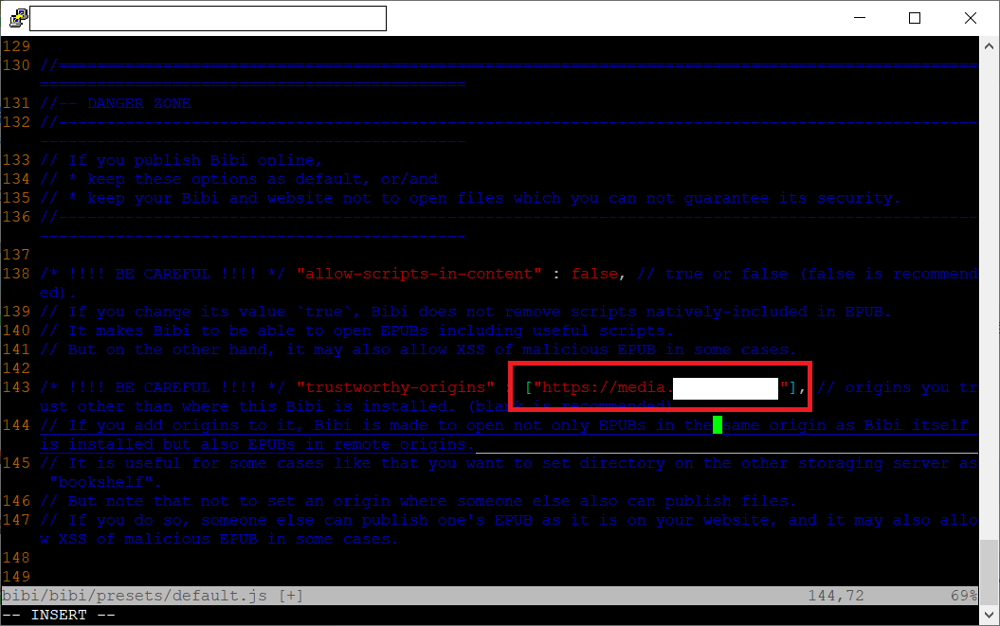
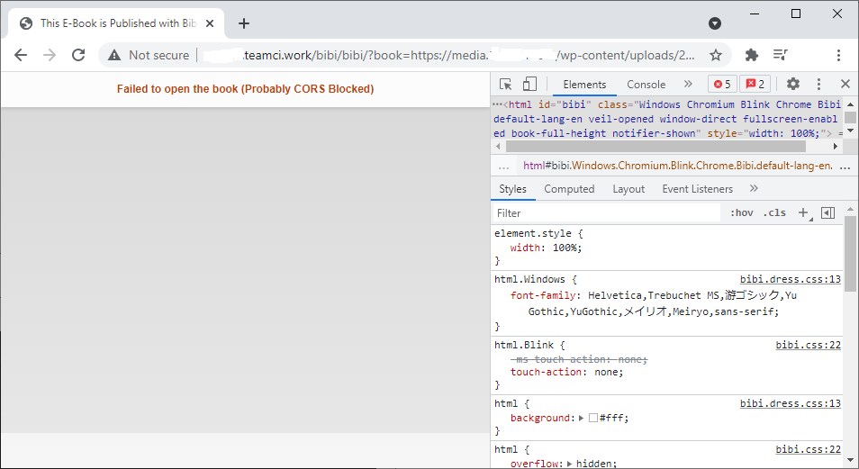
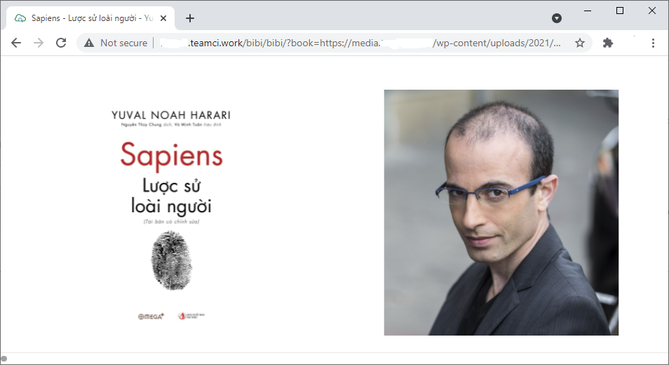

Read epub file from Amazon S3 via Bibi Epub Reader
================================================================================================================================

Summary
--------------------------------------------------------------------------------------------------------------------------------
You can put EPUB book on Amazon S3 and publish the EPUB books on your web, with full-featured viewer running on web browser.

### Table of Contents

1. [Allow origin (Amazon S3)](#allow-origin-amazon-s3)
2. [CORS Configuration](#cors-configuration)
3. [Auto decompress EPUB book when uploaded to s3](#auto-decompress-epub-book-when-uploaded-to-s3)
4. [Test read EPUB book](#test-read-epub-book)

--------------------------------------------------------------------------------------------------------------------------------


Allow origin (Amazon S3)
--------------------------------------------------------------------------------------------------------------------------------

Your website cannot read remote EPUB book if origin of the path of book is not allowed.




Edit `trustworthy-origins` in `bibi/presets/default.js` file and add your Amazon S3 origin.




CORS Configuration
--------------------------------------------------------------------------------------------------------------------------------

Your website cannot read remote EPUB book if you don't setup cross-origin resource sharing on the origin side.



Open your S3 bucket console and edit Cross-origin resource sharing (CORS)

````json
[
    {
        "AllowedHeaders": [
            "*"
        ],
        "AllowedMethods": [
            "GET",
            "HEAD"
        ],
        "AllowedOrigins": [
            "http://xxx.teamci.work"
        ],
        "ExposeHeaders": [],
        "MaxAgeSeconds": 3000
    }
]
````


Auto decompress EPUB book when uploaded to s3
--------------------------------------------------------------------------------------------------------------------------------

Bibi EPUB reader will read files after the EPUB book has been decompressed.
So you need to decompress the EPUB book on Amazon S3 via AWS Lambda.
* Set an event to notify AWS Lambda when an EPUB book is uploaded.
* Decompress the EPUB book.
* Upload decompressed file to S3 bucket with corresponding ContentType (Otherwise all ContentType of the file will be `binary/octet-stream`).

[Lambda code](lambda/lambda_function.py)


Test read EPUB book
--------------------------------------------------------------------------------------------------------------------------------

Now you can read EPUB book from Amazon S3 via Bibi EPUB Reader.

